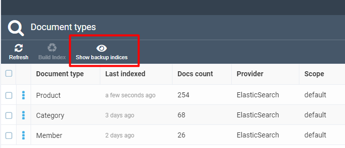
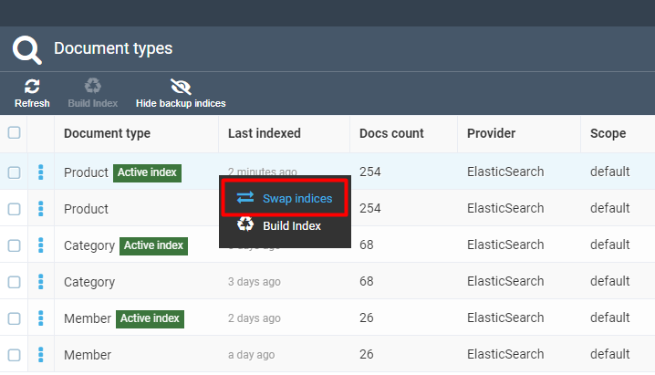
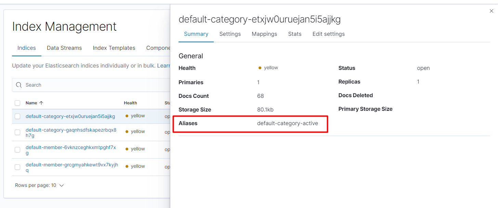

# Blue-Green Indexing

## Overview

Starting version 3.201.0, Elasticsearch supports blue-green indexing. This means after running full index Rebuild+Delete:
1. A new backup index will be created for the selected document type.
2. The indexing process will be run against this backup index.
3. During the full indexation process, the current index will remain intact and one will be able to perform all search operations against it.
4. After reindexing is complete, the index will get swapped: the backup index will now become active, while the current one's role will switch to backup.
5. To roll back to using the previous index, use the Swap Index feature: click *Show Backup Indices*, right click the row for the selected document type you want to switch to, and click *Swap Indices*; this will cause the backup and active indices to swap their roles again.

6. If you start the reindexing process again, the previous backup index will be lost and all indexing jobs will run against the new backup index instead.

## Implementation Details

Elasticsearch implements blue-green indexing using Elasticsearch [aliases](https://www.elastic.co/guide/en/elasticsearch/reference/current/indices-aliases.html). The search provider implementations use two aliases to tell one index role from the other: *active* and *backup*. Full index alias is built as *scope name + document type name + alias name*; e.g., an active index alias for the *Members* index using `default` scope will look like this: `default-member-active`.

Each time you start the *Rebuild+Delete* process, the Elasticsearch index provider looks for an existing backup index by backup alias, e.g., `default-member-backup`, and deletes it in case it is found. After that, when the reidnexing process starts, a new backup index gets created with the `backup` alias. An actual index name is created dynamically, however: this is a special alphanumeric token suffix that is added to the end of the index name. The only way to tell which index is active is to look at its alias. After the indexing process is complete, the active and backup indices swap aliases, meaning that the active index becomes the backup one, and vice versa.

